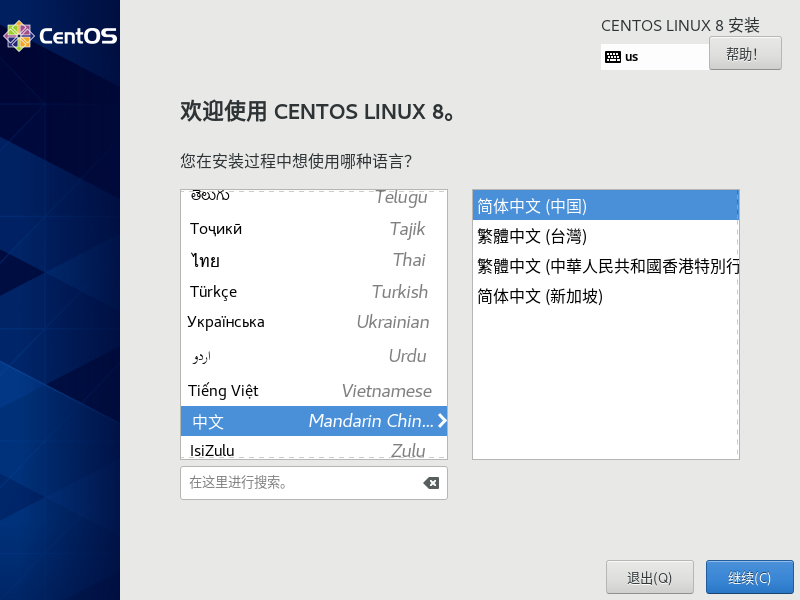
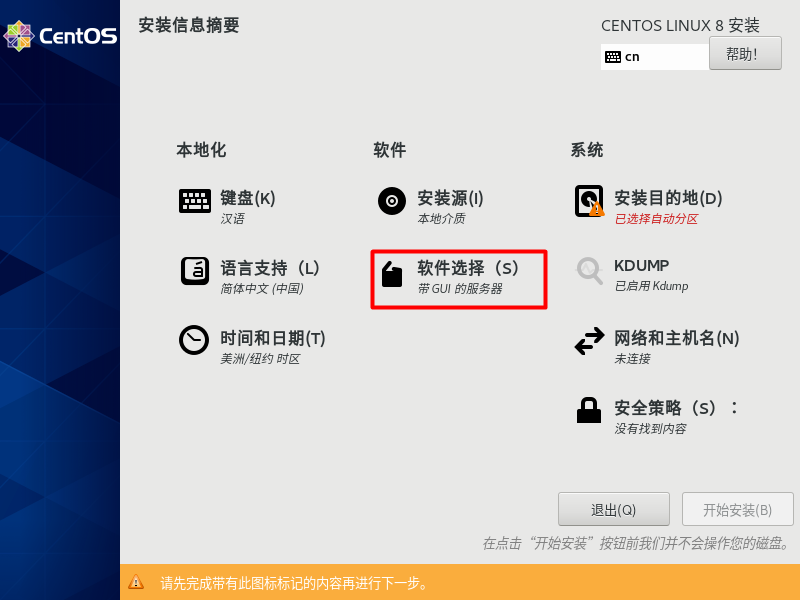
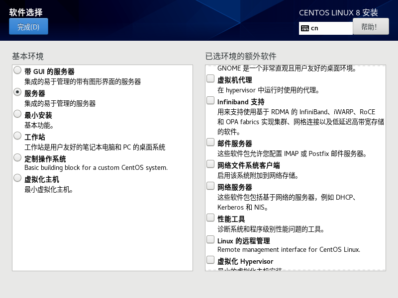
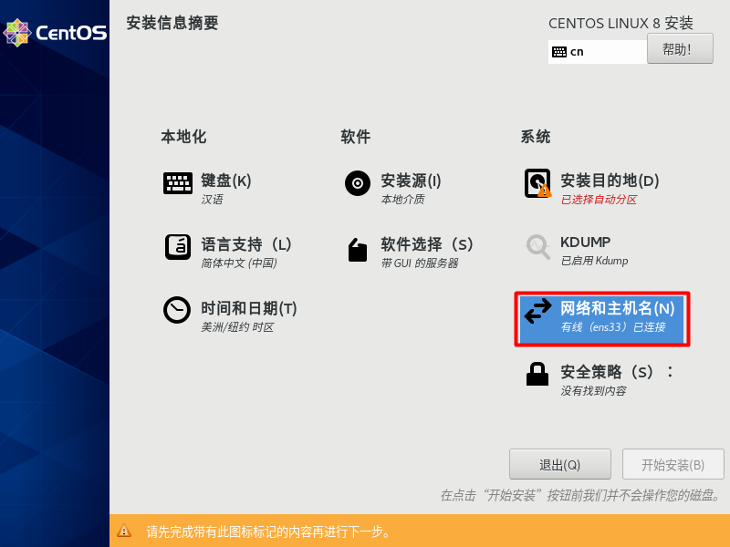
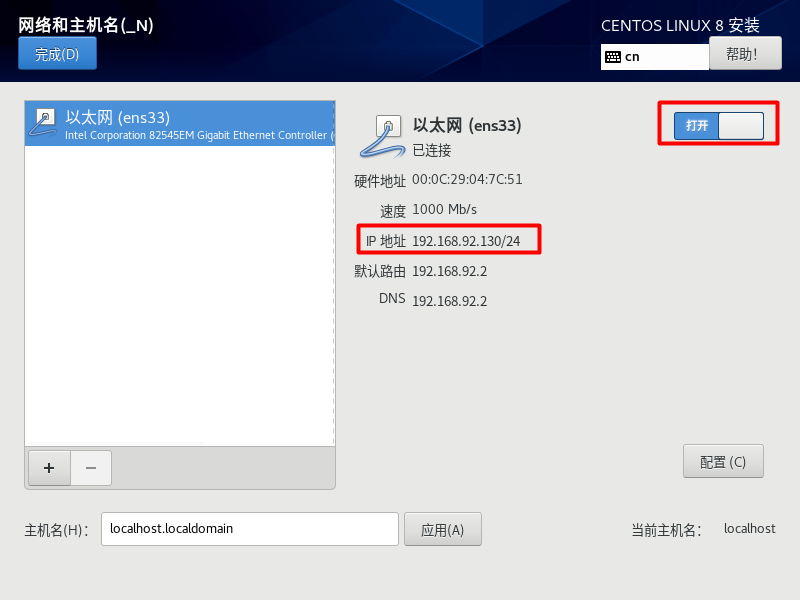
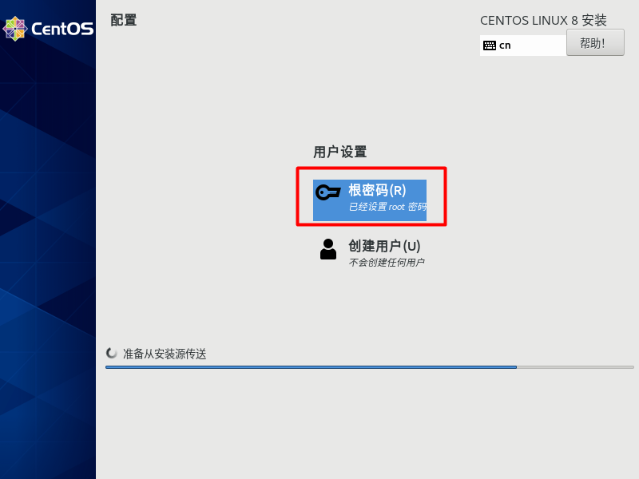

# Centos 8

## vmware [百度网盘下载](https://pan.baidu.com/s/12mVzRyWDrPCyjl-3lA5BRw) 
提取码：6j5o  

[Centos官网下载](https://www.centos.org/)

## 安装

1. 选择安装界面语言 (中文/简体中文)，继续

 

2. 软件选择(服务器)，开始安装

   

   
   
3. 设置网络，打开网络，会显示自动获取的ip地址，需要固定ip可以自行配置

   

   

4. 设置root密码

   

## 使用SecureCRT连接centos系统

   SecureCRT操作，上传下载文件等方便

[百度网盘下载](https://pan.baidu.com/s/1mBOVNhYr_7lerN-qA6FDLA) 

提取码：gnlg  

