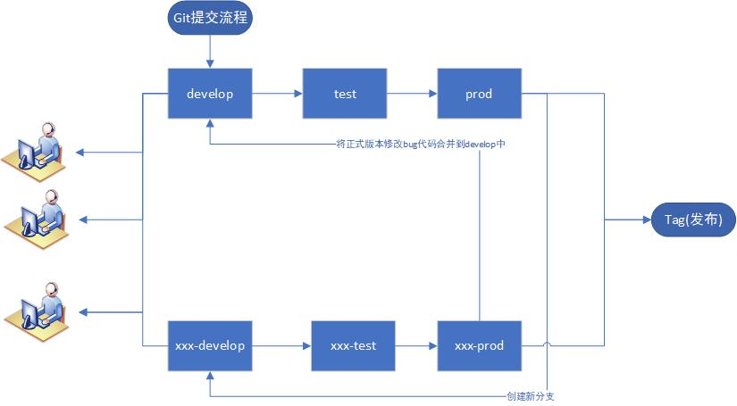

## git分支流程和操作注意事项

建议win系统安装使用 [tortoisegit](https://tortoisegit.org/download/)，并下载中文语言包进行安装，tortoisegit可以直观在win右键中操作git功能，并且通过安装中文语言包后，菜单全是中文，tortoisegit克隆项目时请使用项目HTTPS连接进行克隆

[gitlab官方地址](https://gitlab.com/)

### 新增分支名称规则

    开发分支以 xxx-dev 对应访问地址： http://server/xxx-dev/
    测试分支以 xxx-test 对应访问地址： http://server/xxx-test/
    正式分支以 xxx-prod 对应访问地址： http://server/xxx-prod/

#### 注：访问地址
     前端项目：项目访问初始地址，
     后端项目：接口访问地址

ci在自动打包客户端的时候会自动调用最后一个“-”后面名称作为config的NODE_APP_INSTANCE值，将决定打包时调用的config调用值

如分支名称为1.0.x-develop，ci打包时会使用production-develop.json的配置值

所有需要发布给客户的只能通过tag版本发布

